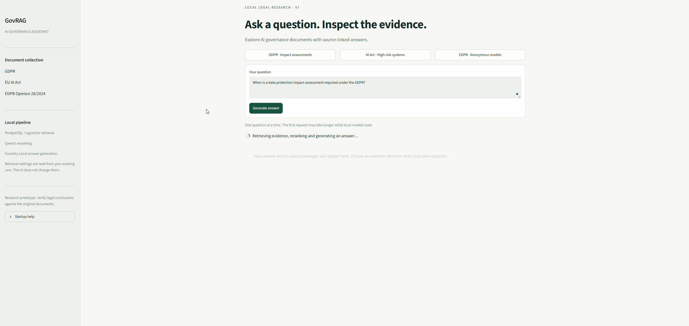
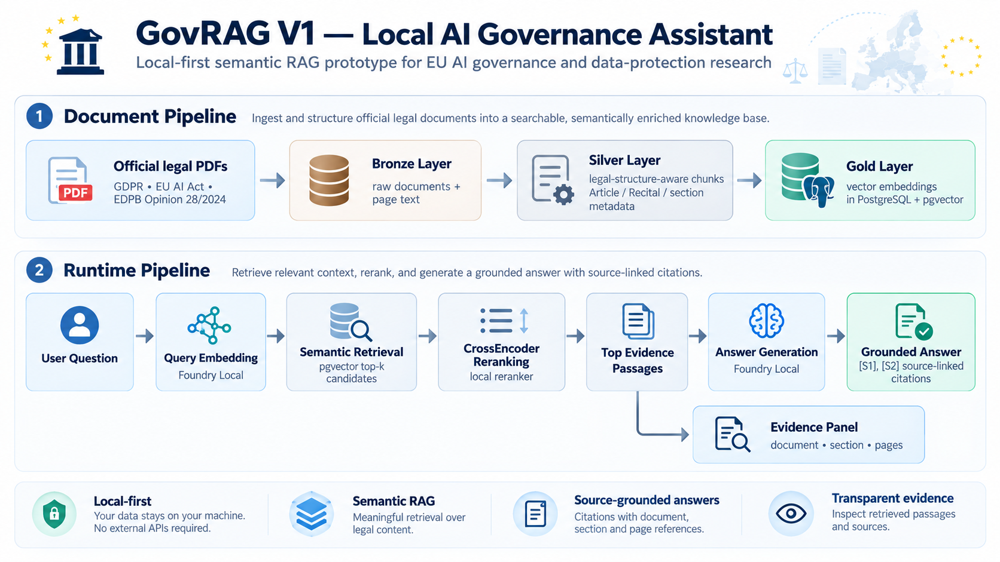

# GovRAG — Local AI Governance Assistant

**GovRAG** is a local-first Retrieval-Augmented Generation (RAG) prototype for EU AI governance and data-protection research.

The project was developed during **Microsoft AI Summer 2026** and is presented here as a completed V1 engineering project focused on local inference, legal-document retrieval, evidence transparency, and source-grounded answer generation.

> **Naming note:** GovRAG means **Governance RAG** in this repository. V1 is a semantic RAG + reranking system; it is **not** a GraphRAG implementation.

---

## Demo

GovRAG retrieves evidence from a curated EU legal corpus, reranks the retrieved passages, and generates a locally produced answer linked back to the supporting legal sources.



The demo shows the runtime flow:

**Question → semantic retrieval → CrossEncoder reranking → local answer generation → source-linked evidence**

The interface exposes both the generated answer and the supporting passages, including legal section and page-level provenance.

---

## System Architecture



GovRAG is divided into two main pipelines:

**Document Pipeline**

Official legal documents are ingested, structured according to their legal hierarchy, chunked with provenance metadata, embedded locally, and stored in PostgreSQL with pgvector.

**Runtime Pipeline**

A user question is embedded locally, matched against the vector store, reranked with a local CrossEncoder, and passed with the strongest evidence passages to a local language model for grounded answer generation.

---

## What GovRAG Does

GovRAG answers questions over a curated legal corpus while exposing the passages used as evidence.

Core capabilities include:

- legal-structure-aware PDF ingestion
- page-level provenance
- Article / Recital / section-aware chunking
- PostgreSQL + pgvector semantic retrieval
- local CrossEncoder reranking
- Microsoft Foundry Local embeddings
- local answer generation
- `[S#]` source-marker validation
- Streamlit answer and evidence interface
- source-anchor retrieval evaluation
- offline/local-first inference architecture

The project is a **research and engineering prototype**, not a legal-advice system.

---

## Pipeline Design

### Bronze Layer

The Bronze layer preserves the original document content and provenance:

- stable document identity
- raw extracted text
- page-level text
- document metadata
- source hashes
- page counts

### Silver Layer

The Silver layer converts raw documents into retrieval-ready legal units while preserving legal structure:

- Articles
- Recitals
- legal sections
- section titles
- page ranges
- chunk hashes
- chunking-version metadata

Chunks are created inside legal structural boundaries rather than by treating the entire document as an undifferentiated text stream.

### Gold Layer

The Gold layer stores vector representations of Silver chunks using PostgreSQL and pgvector.

Embeddings are linked back to their original structured chunks so retrieved passages retain document, legal-section, and page-level provenance.

### Retrieval

At query time:

1. the user question is embedded locally;
2. pgvector retrieves the top semantic candidates;
3. a local CrossEncoder reranks those candidates;
4. the strongest passages are selected as evidence.

### Generation

The selected passages are supplied to a local chat model through Microsoft Foundry Local.

The generation prompt instructs the model to:

- answer only from supplied evidence;
- prefer binding provisions when stating legal obligations;
- distinguish explanatory Recitals from binding Articles;
- use `[S#]` source markers;
- state when the supplied evidence is insufficient.

The Streamlit interface displays the answer and retrieved evidence side by side.

---

## Current V1 Corpus

The repository contains a versioned 10-document corpus manifest, while the completed V1 demo intentionally enables three sources:

1. **GDPR — Regulation (EU) 2016/679**
2. **EU AI Act — Regulation (EU) 2024/1689**
3. **EDPB Opinion 28/2024 on AI Models**

Additional EDPB, WP29, and European Commission materials are included in the manifest as disabled expansion targets.

The legal PDFs themselves are not committed to the repository.

Official source URLs and document metadata are defined in:

```text
config/corpus_manifest.json
```

Downloaded files should be placed in:

```text
data/raw/
```

using the filenames defined in the manifest.

---

## Retrieval and Grounding

The runtime pipeline follows the same retrieval configuration for both the CLI and Streamlit interface:

```text
User Question
      ↓
Local Query Embedding
      ↓
PostgreSQL + pgvector
      ↓
Top-k Semantic Candidates
      ↓
Local CrossEncoder Reranker
      ↓
Top Evidence Passages
      ↓
Foundry Local Chat Model
      ↓
Grounded Answer + [S#] Citations
```

Each retrieved passage retains metadata such as:

```text
Document
Section type
Section reference
Section title
Page range
Vector similarity
Reranker score
```

Citation-marker validation confirms that generated `[S#]` references point to passages actually supplied to the model.

It does **not** independently establish that every generated legal claim is substantively correct.

---

## Development Evaluation

GovRAG includes a small development evaluation set:

```text
test/eval_questions.json
```

The set contains **10 hand-authored, answerable questions** covering:

- GDPR
- EU AI Act
- EDPB Opinion 28/2024

Recorded V1 source-anchor retrieval results:

| Stage | Result |
|---|---:|
| Semantic retrieval — top 20 | **10 / 10** expected source anchors retrieved |
| CrossEncoder reranking — top 4 | **9 / 10** expected source anchors retained |

The evaluation runner is available at:

```text
test/evaluation_test.py
```

Recorded outputs are stored under:

```text
test/evaluation_results/
```

The one reranking miss is intentionally preserved in the committed evaluation results for inspection.

> These results are a **development smoke test**, not a held-out benchmark, production-quality legal evaluation, or certification of legal reliability.

The current evaluation measures source-anchor retrieval rather than full end-to-end legal correctness or hallucination resistance.

---

## Tech Stack

| Component | Technology |
|---|---|
| Language | Python |
| Database | PostgreSQL |
| Vector search | pgvector |
| PDF processing | PyMuPDF |
| Tokenization | tiktoken |
| Local model runtime | Microsoft Foundry Local |
| Embeddings | Qwen3 embedding model |
| Reranking | `sentence-transformers` CrossEncoder |
| Answer generation | Qwen2.5 local chat model |
| ML runtime | PyTorch |
| Interface | Streamlit |

Python 3.13 was used during development.

Other Python versions have not been formally validated for this repository.

---

## Repository Structure

```text
GovRag-local-ai-governance-assistant/
│
├── config/
│   └── corpus_manifest.json
│
├── data/
│   └── raw/                       # local legal PDFs, ignored by git
│
├── scripts/
│   └── audit_corpus.py
│
├── sql/
│   ├── bronze/
│   ├── silver/
│   └── gold/
│
├── src/
│   ├── ingestion/
│   ├── processing/
│   ├── embeddings/
│   ├── retrieval/
│   └── generation/
│
├── test/
│   ├── eval_questions.json
│   ├── evaluation_test.py
│   └── evaluation_results/
│
├── .env.example
├── architecture.png
├── demo_example_question.gif
├── govrag_app.py
├── requirements.txt
├── start_govrag.ps1
└── README.md
```

---

# Local Setup

## 1. Clone the Repository

```powershell
git clone https://github.com/kdrmz1695/GovRag-local-ai-governance-assistant.git
cd GovRag-local-ai-governance-assistant
```

Create and activate a Python virtual environment:

```powershell
python -m venv .venv
.\.venv\Scripts\Activate.ps1
```

Install dependencies:

```powershell
python -m pip install --upgrade pip
pip install -r requirements.txt
```

If CUDA is used for reranking, install the PyTorch build appropriate for the local GPU and driver.

---

## 2. Configure PostgreSQL and pgvector

Create a PostgreSQL database and enable the pgvector extension.

The project uses three schemas:

```text
bronze
silver
gold
```

Database definitions are located under:

```text
sql/
```

Run the SQL files in their intended schema order before building the corpus.

---

## 3. Add the Legal Documents

Download the enabled documents from the official URLs defined in:

```text
config/corpus_manifest.json
```

Place the PDFs in:

```text
data/raw/
```

using the exact filenames defined in the manifest.

Before ingestion, the corpus can be checked with:

```powershell
python scripts\audit_corpus.py --no-database
```

---

## 4. Configure Environment Variables

Copy the example configuration:

```powershell
Copy-Item .env.example .env
```

Configure:

```text
PostgreSQL connection
Foundry Local model IDs
Embedding configuration
Reranker model
Retrieval parameters
Chat-generation parameters
```

The populated `.env` file is excluded from Git.

---

## 5. Start Foundry Local

Start the local model services:

```powershell
.\start_govrag.ps1
```

The startup script:

- starts the Foundry Local server;
- discovers the active local service URL;
- updates `FOUNDRY_BASE_URL`;
- loads the configured embedding model;
- loads the configured chat model;
- verifies the local model endpoint.

A successful startup ends with:

```text
GovRAG services are ready.
```

---

## 6. Build the Corpus

### Bronze ingestion

```powershell
python src\ingestion\ingest_raw_pdfs_to_postgres.py --all
```

Optional dry run:

```powershell
python src\ingestion\ingest_raw_pdfs_to_postgres.py --all --dry-run
```

### Silver legal chunking

```powershell
python src\processing\create_silver_chunks.py --all
```

Optional dry run:

```powershell
python src\processing\create_silver_chunks.py --all --dry-run
```

### Gold embeddings

```powershell
python src\embeddings\create_gold_embeddings.py
```

### Corpus audit

```powershell
python scripts\audit_corpus.py
```

The pipeline preserves unchanged chunks and embeddings where possible rather than unnecessarily rebuilding the entire corpus.

---

## 7. Run the Retrieval Evaluation

```powershell
python test\evaluation_test.py
```

Each evaluation creates a timestamped directory containing:

```text
results.json
summary.csv
```

The evaluation is read-only and does not modify the production corpus.

---

## 8. Launch GovRAG

Once Foundry Local and PostgreSQL are running:

```powershell
python govrag_app.py
```

The application launches a local Streamlit interface, normally at:

```text
http://127.0.0.1:8501
```

From the interface you can:

- ask an AI-governance question;
- inspect the generated answer;
- view source markers;
- open the retrieved evidence passages;
- inspect Article / Recital / section metadata;
- inspect page-level provenance;
- compare vector and reranker scores.

---

## Example Questions

GovRAG includes example questions such as:

```text
When is a data protection impact assessment required under the GDPR?
```

```text
How does the EU AI Act determine whether an AI system is high-risk?
```

```text
According to EDPB Opinion 28/2024, what conditions must be met for an AI model trained on personal data to be considered anonymous?
```

---

## Design Principles

### Local-first

Embedding, reranking, retrieval, and answer generation are designed to operate locally.

### Evidence before answer

The system retrieves and reranks legal evidence before asking the language model to answer.

### Legal structure preservation

Documents are not treated only as arbitrary text windows. Article, Recital, section, title, and page metadata are preserved during processing.

### Transparent retrieval

The interface exposes the evidence presented to the language model rather than displaying only the final answer.

### Reproducible corpus processing

Stable document identities, hashes, manifest metadata, versioned chunking, and audit tooling help make corpus changes explicit.

---

## V1 Boundaries

GovRAG V1 is intentionally frozen as a **semantic RAG engineering prototype**.

It does **not** currently implement:

- knowledge-graph construction;
- graph traversal;
- multi-hop GraphRAG retrieval;
- a production-grade legal benchmark;
- automated validation of substantive legal correctness;
- automatic synchronization with amendments to the underlying law;
- deployment as legal advice or automated compliance decision support.

These are separate research directions rather than unfinished V1 features.

---

## Evaluation Transparency

The committed evaluation artifacts are intentionally inspectable:

```text
test/eval_questions.json
test/evaluation_test.py
test/evaluation_results/
```

Expected answers, expected source anchors, and review notes are **not passed into the retrieval model** during evaluation.

This keeps the development evaluation separate from inference.

---

## Project Status

**GovRAG V1 is complete and frozen as a portfolio engineering project.**

The project demonstrates a complete local semantic-RAG pipeline for legal AI-governance research:

```text
PDF ingestion
→ legal structure extraction
→ structured chunking
→ local embeddings
→ pgvector retrieval
→ CrossEncoder reranking
→ local answer generation
→ source-linked evidence inspection
```

Future academic work may reuse parts of this implementation as a **semantic RAG baseline**, while GraphRAG, legal-graph construction, and traversal-depth experiments are treated as separate research work.

---

## Disclaimer

GovRAG is an experimental software and research prototype.

It does not provide legal advice, and generated answers should be verified against the original legal sources.
