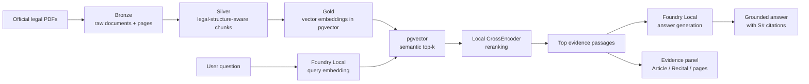

# GovRAG — Local AI Governance Assistant

**GovRAG** is a local-first Retrieval-Augmented Generation (RAG) prototype for EU AI governance and data-protection research. It was developed during **Microsoft AI Summer 2026** and is packaged here as a completed V1 engineering project.

> **Naming note:** GovRAG means **Governance RAG** in this repository. V1 is a semantic RAG + reranking system; it is **not** a GraphRAG implementation.

## What it does

GovRAG answers questions over a curated legal corpus while exposing the passages used as evidence. The pipeline is designed to keep retrieval and generation local:

- legal-structure-aware PDF ingestion
- page-level provenance
- Article / Recital / section-aware chunking
- PostgreSQL + pgvector semantic retrieval
- local CrossEncoder reranking
- Foundry Local embeddings and answer generation
- source markers validated in generated answers
- Streamlit UI with answer and evidence panels
- small source-anchor retrieval evaluation suite

The project is a research prototype, not a legal-advice system.

## Architecture



### Data layers

| Layer | Purpose |
|---|---|
| **Bronze** | Raw document text, stable document identity, hashes, and page-level text |
| **Silver** | Structure-aware chunks with Article, Recital, section, title, and page metadata |
| **Gold** | Embeddings linked to Silver chunks and stored with pgvector |
| **Retrieval** | Dense semantic search followed by CrossEncoder reranking |
| **Generation** | Local LLM answer generation constrained to retrieved passages |

## Current V1 corpus

The repository contains a versioned 10-document corpus manifest, but the completed V1 demo intentionally enables only three sources:

1. **GDPR — Regulation (EU) 2016/679**
2. **EU AI Act — Regulation (EU) 2024/1689**
3. **EDPB Opinion 28/2024 on AI Models**

Additional EDPB, WP29, and European Commission guidance is listed in the manifest as disabled expansion targets. The PDFs themselves are not committed to the repository; obtain them from the official source URLs in `config/corpus_manifest.json` and place them in `data/raw/`.

## Retrieval and grounding

The runtime pipeline uses the same configuration for both CLI and Streamlit:

1. embed the user question locally;
2. retrieve semantic candidates from PostgreSQL/pgvector;
3. rerank candidates with a local CrossEncoder;
4. provide the top evidence passages to the local chat model;
5. require `[S#]` source markers for legal claims;
6. display the retrieved evidence beside the generated answer.

The generation prompt prefers binding provisions when stating obligations, treats Recitals as explanatory context, and instructs the model to state when the supplied evidence is insufficient.

Citation-marker validation checks that generated `[S#]` markers are syntactically valid and refer to supplied passages. It does **not** independently prove that every legal claim is substantively correct.

## Development evaluation

A small development set in `test/eval_questions.json` contains 10 hand-authored, answerable questions covering the GDPR, EU AI Act, and EDPB Opinion 28/2024.

Recorded V1 source-anchor retrieval results:

| Stage | Result |
|---|---:|
| Semantic retrieval, top-20 | **10 / 10** questions contained an expected source anchor |
| Reranked retrieval, top-4 | **9 / 10** questions retained an expected source anchor |

The one reranking miss is preserved in the committed evaluation output for inspection.

These numbers are a **development smoke test**, not a held-out benchmark, legal-reliability certification, or claim of production readiness. The evaluation currently covers source-anchor retrieval, not end-to-end legal correctness or hallucination resistance.

## Tech stack

- Python
- PostgreSQL + pgvector
- PyMuPDF
- tiktoken
- Microsoft Foundry Local
- Qwen3 embedding model alias loaded by the startup script
- local `sentence-transformers` CrossEncoder reranker
- Qwen2.5 chat model alias loaded by the startup script
- Streamlit
- PyTorch

Python 3.13 was used during development. Other Python versions have not been validated for this repository.

## Repository layout

```text
config/
  corpus_manifest.json
data/
  raw/                       # local PDFs; ignored by git
scripts/
  audit_corpus.py
sql/
  bronze/
  silver/
  gold/
src/
  ingestion/
  processing/
  embeddings/
  retrieval/
  generation/
test/
  eval_questions.json
  evaluation_test.py
  evaluation_results/
govrag_app.py
start_govrag.ps1
requirements.txt
.env.example
```

## Local setup

### 1. Clone and create an environment

```powershell
git clone https://github.com/kdrmz1695/GovRag-local-ai-governance-assistant.git
cd GovRag-local-ai-governance-assistant

python -m venv .venv
.\.venv\Scripts\Activate.ps1
python -m pip install --upgrade pip
pip install -r requirements.txt
```

If you use CUDA, install the PyTorch build appropriate for your GPU/driver before running the reranker.

### 2. Configure PostgreSQL and pgvector

Create a PostgreSQL database, enable pgvector, and run the SQL files under `sql/` in their intended schema order.

The pipeline expects the `bronze`, `silver`, and `gold` schemas defined by the repository SQL.

### 3. Add the legal documents

Download the enabled PDFs from the official URLs in `config/corpus_manifest.json` and save them under `data/raw/` using the exact manifest filenames.

Run a file/manifest audit before ingestion:

```powershell
python scripts\audit_corpus.py --no-database
```

### 4. Configure the environment

```powershell
Copy-Item .env.example .env
```

Fill in the database credentials and the model IDs/versions for your local Foundry installation and cached reranker.

### 5. Start Foundry Local

```powershell
.\start_govrag.ps1
```

The script starts the Foundry Local server, discovers its dynamic local URL, updates `FOUNDRY_BASE_URL` in `.env`, loads the configured embedding/chat model aliases, and verifies the local model endpoint.

### 6. Build the corpus pipeline

```powershell
python src\ingestion\ingest_raw_pdfs_to_postgres.py --all
python src\processing\create_silver_chunks.py --all
python src\embeddings\create_gold_embeddings.py
python scripts\audit_corpus.py
```

The ingestion and Silver scripts also support `--dry-run`; the embedding script skips unchanged chunk/model combinations.

### 7. Run a retrieval evaluation

```powershell
python test\evaluation_test.py
```

Each run writes a timestamped result folder containing detailed JSON diagnostics and a CSV summary.

### 8. Launch the demo

```powershell
python govrag_app.py
```

The app opens a local Streamlit interface where a user can ask a question, inspect the generated answer, and open each retrieved evidence passage with its legal section and page metadata.

## V1 boundaries

GovRAG V1 is intentionally frozen as a semantic RAG engineering prototype.

It does **not** currently implement:

- knowledge-graph construction or graph traversal;
- multi-hop GraphRAG retrieval;
- a production-grade legal benchmark;
- automated validation of substantive legal correctness;
- continuous synchronization with amendments to the underlying law;
- deployment as legal advice or compliance decision support.

Those are separate research directions rather than unfinished V1 features.

## Evaluation files

The committed evaluation artifacts are intentionally transparent:

- `test/eval_questions.json` — question set, expected source anchors, and review notes
- `test/evaluation_test.py` — read-only retrieval evaluation
- `test/evaluation_results/` — recorded run output

The evaluation code does not pass expected answers, expected sources, or review notes into the retrieval model.

## Project status

**V1 complete / archived as a portfolio engineering project.**

Future academic work may reuse parts of this pipeline as a semantic-RAG baseline, but GraphRAG and traversal-depth experiments are outside the scope of this repository version.
